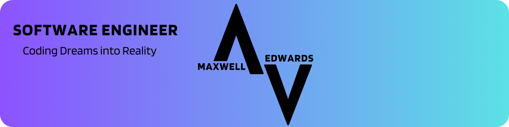

# Hi, I'm Max 👋🖥️



Software Engineer with a track record in architectural design and optimization. Experienced in delivering scalable solutions that drive efficiency and performance.

Let's architect your next success together!

## Languages and Tools 🛠️

```python
max = {
  "languages": ["Python", "C#", "Java", "Kotlin", "JavaScript", "HTML"],
  "tools": ["React.js", ".NET", "Node.js", "Django"],
  "cloud": ["Azure", "AWS"],
  "devOps": ["Docker", "Azure Pipelines", "GitHub Actions"],
  "misc": ["Agile", "Scrum", "Kanban", "Jira", "Confluence"]
}
```

## Favorite Books 📚

- [Deep Work](https://positivepsychology.com/deep-work/) by Cal Newport
- [Atomic Habits](https://jamesclear.com/atomic-habits) by James Clear
- [Essentialism](https://pocketwisdom.blog/2021/08/16/essentialism-by-greg-mckeown/) by Greg McKeown

<a href="https://maxedwards.io/"></a>

### Find me around the web 🌎

<hr style="margin-top:-5px; margin-bottom: 5px;">

Sharing updates on [LinkedIn](https://linkedin.com/in/maxwell-edwards20/) 💼

Posting various demos on my [portoflio](https://maxedwards.io) 💻
