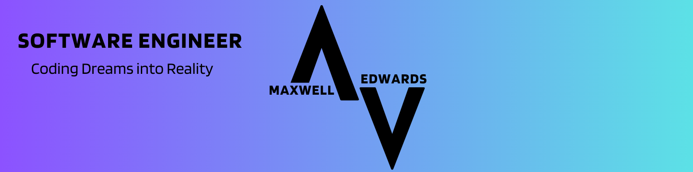

# Hi, I'm Max 👋🖥️

<!--  -->

I am currently working on my own fitness-tracking app, Apollo.

Strongest Ability: Developing APIs for large-scale applications (100,000+ users) 😄

Current Focus: Developing a Swift Application with SwiftUI and SwiftData.

Notable Projects: High Performance GPU and CPU clustering, Multiplayer Snake using Event Driven Architecture, and Milo the Chatbot.

### Find me around the web 🌎

Sharing updates on [LinkedIn](https://linkedin.com/in/maxwell-edwards20/) 💼

Posting various demos on my [portoflio](https://maxedwards.io) 💻
